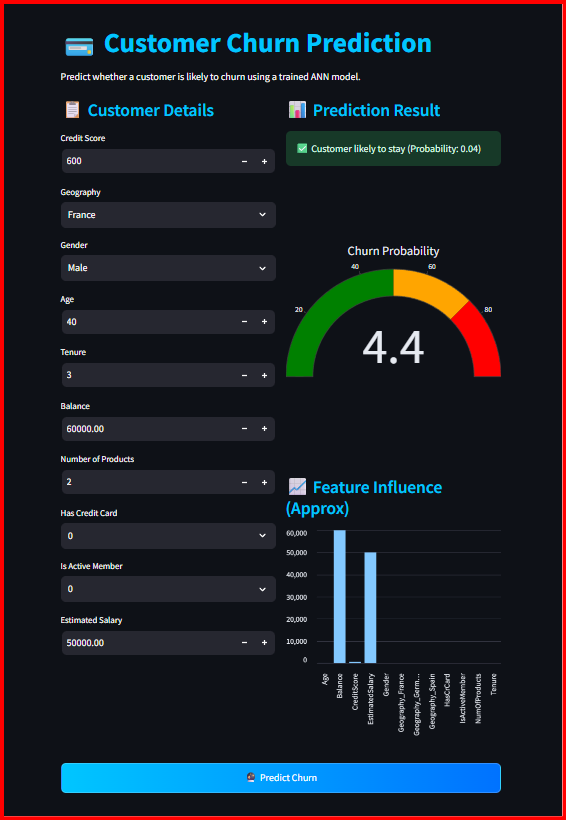

# 💳 Customer Churn Prediction Web App

An end-to-end machine learning web application that predicts whether a bank customer is likely to churn using a trained Artificial Neural Network (ANN).  
The app provides real-time predictions with probability visualization and feature impact insights.

---

## 🚀 Live Demo
👉 https://customer-churn-prediction-ann-gwwv56tbz6wpsp8nhgmfnc.streamlit.app/

---

## 📸 App Preview


---

## 📌 Project Overview

Customer churn prediction is a critical business problem in the banking and telecom industries.  
This project builds a deep learning model to identify customers at high risk of leaving, enabling proactive retention strategies.

The project covers the full ML lifecycle:

✔ Data preprocessing  
✔ Feature engineering  
✔ Model training using ANN  
✔ Model evaluation  
✔ Deployment using Streamlit  
✔ Interactive dashboard with insights  

---

## 🧠 Features

- 🔮 Real-time churn prediction
- 📊 Probability gauge visualization
- 📈 Feature influence insights
- ⚡ Fast inference using saved preprocessing pipeline
- 🎨 Interactive modern UI
- ☁️ Cloud deployable

---

## 🏗️ Tech Stack

| Category | Tools |
|----------|------|
| Language | Python |
| ML / DL | TensorFlow, Scikit-learn |
| Data | Pandas, NumPy |
| Visualization | Plotly |
| Deployment | Streamlit |
| Version Control | Git & GitHub |

---

## 📂 Project Structure

```
customer-churn-prediction-ann/
│
├── app.py
├── model.h5
├── scaler.pkl
├── onehot_encoder_geo.pkl
├── label_encoder_gender.pkl
├── requirements.txt
├── assets/
│   |── style.css
│   └── Churn Prediction.png
└── notebooks/
    └── model_training.ipynb
```

---

## ⚙️ Model Details

- Model Type: Artificial Neural Network (ANN)
- Framework: TensorFlow / Keras
- Problem Type: Binary Classification
- Target Variable: Customer Churn (Yes / No)

### Input Features

- Credit Score  
- Geography  
- Gender  
- Age  
- Tenure  
- Balance  
- Number of Products  
- Has Credit Card  
- Is Active Member  
- Estimated Salary  

---

## 📊 Workflow

1️⃣ Data Cleaning and preprocessing  
2️⃣ Encoding categorical variables  
3️⃣ Feature scaling  
4️⃣ Training ANN model  
5️⃣ Saving model + encoders  
6️⃣ Building Streamlit UI  
7️⃣ Deployment for real-time predictions  

---

## 🖥️ How to Run Locally

```bash
# Clone repository
git clone https://github.com/your-username/customer-churn-prediction-ann.git

# Navigate to project
cd customer-churn-prediction-ann

# Install dependencies
pip install -r requirements.txt

# Run app
streamlit run app.py
```

## 📈 Example Output

- Churn probability score
  
- Visual gauge indicator

- Feature impact bar chart

## 🎯 Business Impact

This solution can help organizations:

- Identify high-risk customers

- Reduce churn rate

- Improve customer retention strategies

- Increase revenue through proactive engagement


## 👨‍💻 Author

**Harsh Kumar**  
B.Tech – Computer Science & Data Science  
Aspiring Machine Learning Engineer  

---
